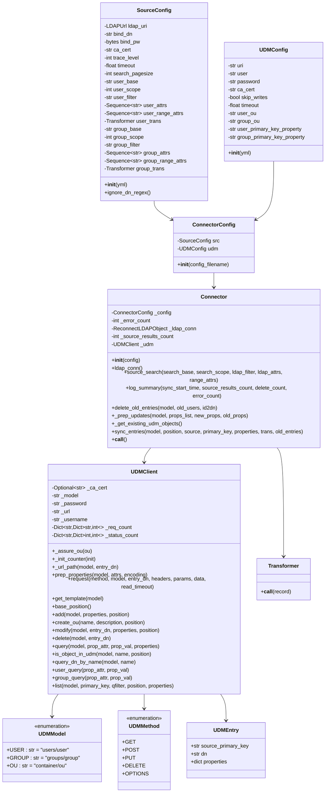

Current state:

```mermaid

classDiagram
    ConnectorConfig --> Connector
    SourceConfig --> ConnectorConfig
    UDMConfig --> ConnectorConfig
    UDMClient --> UDMModel
    UDMClient --> UDMMethod
    UDMClient --> UDMEntry
    Connector --> UDMClient
    Connector --> Transformer

    class SourceConfig {
        -LDAPUrl ldap_uri
        -str bind_dn
        -bytes bind_pw
        -str ca_cert
        -int trace_level
        -float timeout
        -int search_pagesize
        -str user_base
        -int user_scope
        -str user_filter
        -Sequence~str~ user_attrs
        -Sequence~str~ user_range_attrs
        -Transformer user_trans
        -str group_base
        -int group_scope
        -str group_filter
        -Sequence~str~ group_attrs
        -Sequence~str~ group_range_attrs
        -Transformer group_trans
        +__init__(yml)
        +ignore_dn_regex()
    }

    class UDMConfig {
        -str uri
        -str user
        -str password
        -str ca_cert
        -bool skip_writes
        -float timeout
        -str user_ou
        -str group_ou
        -str user_primary_key_property
        -str group_primary_key_property
        +__init__(yml)
    }

    class ConnectorConfig {
        -SourceConfig src
        -UDMConfig udm
        +__init__(config_filename)
    }

    class Connector {
        -ConnectorConfig _config
        -int _error_count
        -ReconnectLDAPObject _ldap_conn
        -int _source_results_count
        -UDMClient _udm
        +__init__(config)
        +ldap_conn()
        +source_search(search_base, search_scope, ldap_filter, ldap_attrs, range_attrs)
        +log_summary(sync_start_time, source_results_count, delete_count, error_count)
        +delete_old_entries(model, old_users, id2dn)
        +_prep_updates(model, props_list, new_props, old_props)
        +_get_existing_udm_objects()
        +sync_entries(model, position, source, primary_key, properties, trans, old_entries)
        +__call__()
    }

    class Transformer {
        %% +__init__(user_primary_key, user_trans, users, id2dn_users, group_primary_key, group_trans, groups, id2dn_groups)
        +__call__(record)
    }

    class UDMModel {
        <<enumeration>>
        +USER : str = "users/user"
        +GROUP : str = "groups/group"
        +OU : str = "container/ou"
    }

    class UDMMethod {
        <<enumeration>>
        +GET
        +POST
        +PUT
        +DELETE
        +OPTIONS
    }

    class UDMEntry {
        +str source_primary_key
        +str dn
        +dict properties
    }

    class UDMClient {
        -Optional~str~ _ca_cert
        -str _model
        -str _password
        -str _url
        -str _username
        -Dict~str,Dict~str,int~~ _req_count
        -Dict~str,Dict~str,Dict~int,int~~ _status_count
        %% +__init__(url, username, password, user_ou, group_ou, ca_cert, skip_writes, connect_timeout, read_timeout)
        +_assure_ou(ou)
        +_init_counter(init)
        +_url_path(model, entry_dn)
        +prep_properties(model, attrs, encoding)
        +request(method, model, entry_dn, headers, params, data, read_timeout)
        +get_template(model)
        +base_position()
        +add(model, properties, position)
        +create_ou(name, description, position)
        +modify(model, entry_dn, properties, position)
        +delete(model, entry_dn)
        +query(model, prop_attr, prop_val, properties)
        +is_object_in_udm(model, name, position)
        +query_dn_by_name(model, name)
        +user_query(prop_attr, prop_val)
        +group_query(prop_attr, prop_val)
        +list(model, primary_key, qfilter, position, properties)
    }


```
