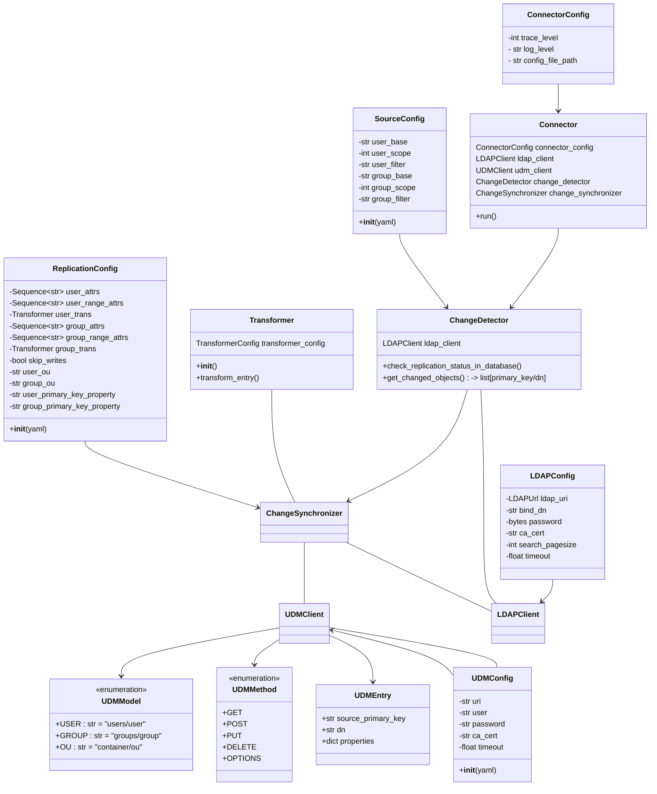

# Proposed State:

This is a spike result from December 2024

It represents a proposed target architecture with the knowledge gained from that spike.
Please use it as an Inspiration and documentation of our understanding at that point in time.

