Since we are doing load tests, I decided that we need some graphs:

User creation durations in Nubus when importing users from AD with the Directory Importer.

Base Scenario:

- every user has a profile picture of 100kb
- 100k Users in AD
- Every user is in one extra group with a maximum group size of 100
- => 100k / 100 = 1k Groups
- UDM adds every user to the same default primary group
- No LDAP index for `univentionObjectIdentifier`
- The LDAP database is written to a Ceph-based pvc

## Initial load test attempt
For more info, see the comments on [this issue](https://git.knut.univention.de/univention/customers/dataport/team-souvap/-/issues/903)

**this is without any group syncs**
because the user sync was aborted around 35k users and group sync happens only after the user sync.

## Disable primary group

Scenario modifications:

- ~~UDM adds every user to the same default primary group~~
- primary group updates are disabled

**this is without any group syncs**
because the user sync was aborted around 80k users
and group sync happens only after the user sync.

User sync durations with linear scale:

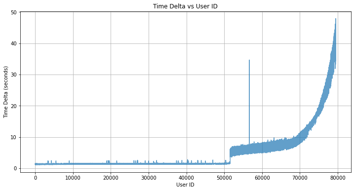

User sync durations with logarythmic scale:

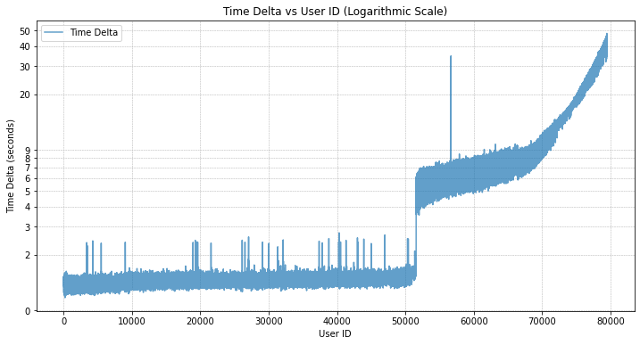

Number of users created over time:

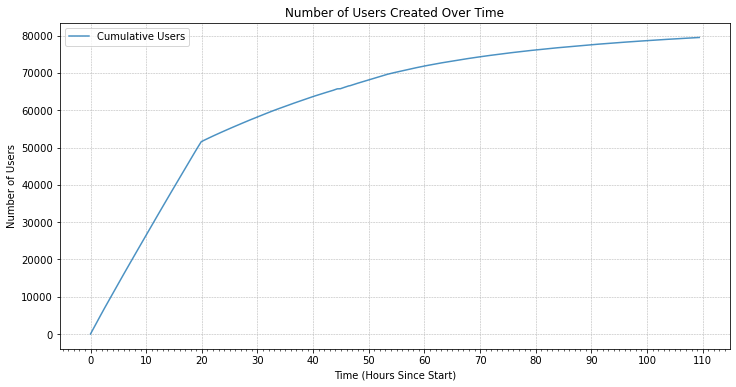

## Index for univentionObjectIdentifier

Scenario modifications:

- ~~UDM adds every user to the same default primary group~~
- primary group updates are disabled
- ~~No LDAP index for `univentionObjectIdentifier`~~
- Added LDAP equality (`eq`) index for `univentionObjectIdentifier` via UCR

Basic stats:

Total users created: 40500  
Total user creation time: 0 days 15:27:24.030000  
average user creation time: 1.3739605916195508  

User sync durations with linear scale:

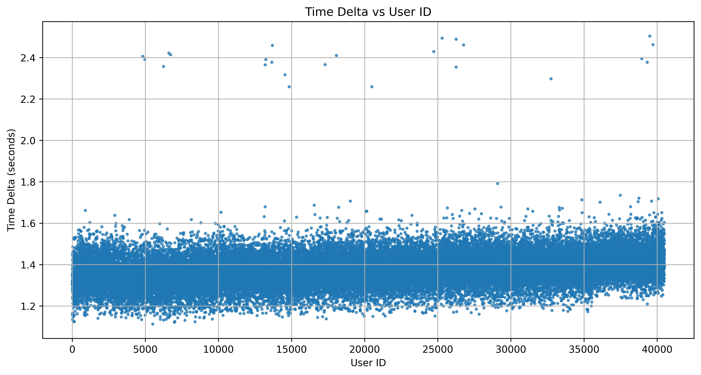

User sync durations with logarythmic scale:

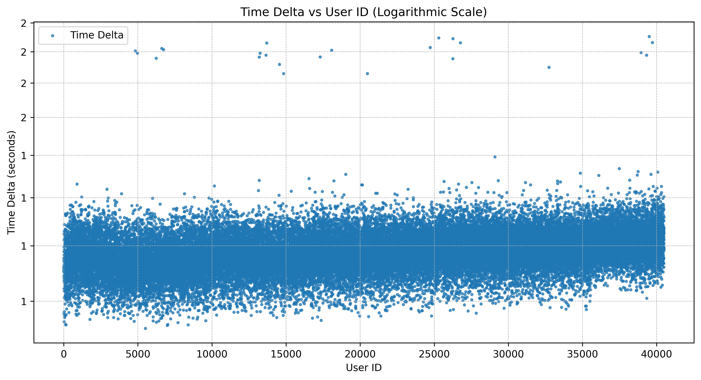

Number of users created over time:

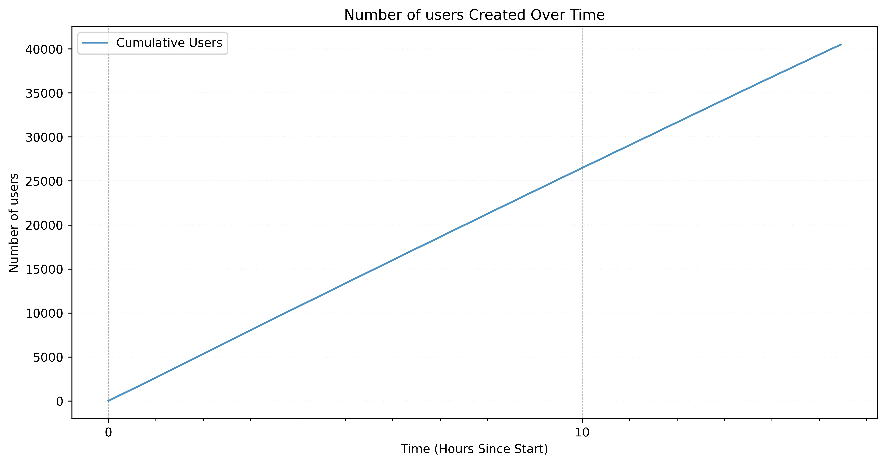

## More groups

Scenario modifications:

- ~~100k Users in AD~~
- 40k Users in AD (to make the LDAP index unnecessary)
- ~~Every user is in one extra group with a maximum group size of 100~~
- ~~=> 100k / 100 = 1k Groups~~
- Every user is in one extra group with a maximum group size of 1000 and
in 10 groups with a maximum group size of 10
- => 40k / 1k + 40k / 10 * 10 = 40040 Groups = 40k Groups
To measure the performance with a 1:1 ratio of users and groups.
- ~~UDM adds every user to the same default primary group~~
- primary group updates are disabled
- ~~The LDAP database is written to a Ceph-based pvc~~
- The LDAP database is written to a local-storage pvc. Significantly increasing the IO performance

**This load test was executed in parallel with the one above.**
This may have affected the local storage IO performance.

Basic stats:

Total users created: 39997  
Total user creation time: 0 days 13:35:34.262000  
Average user creation time: 1.2201522152215112  
Total groups created: 40037  
Total group creation time: 0 days 03:54:40.574000  
Average group creation times:  
Overall average: 0.3515764811669442 
Average for groups with 10 members: 0.3506403140313977  
Average for groups with 1000 members: 1.28765  

User sync durations with linear scale:

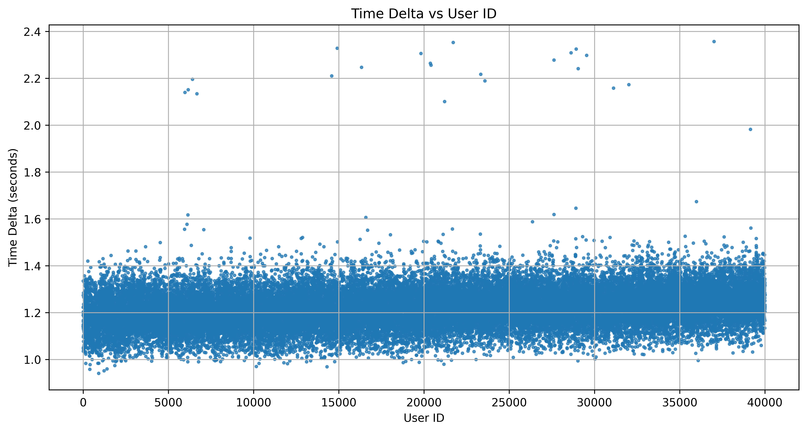

User sync durations with logarythmic scale:

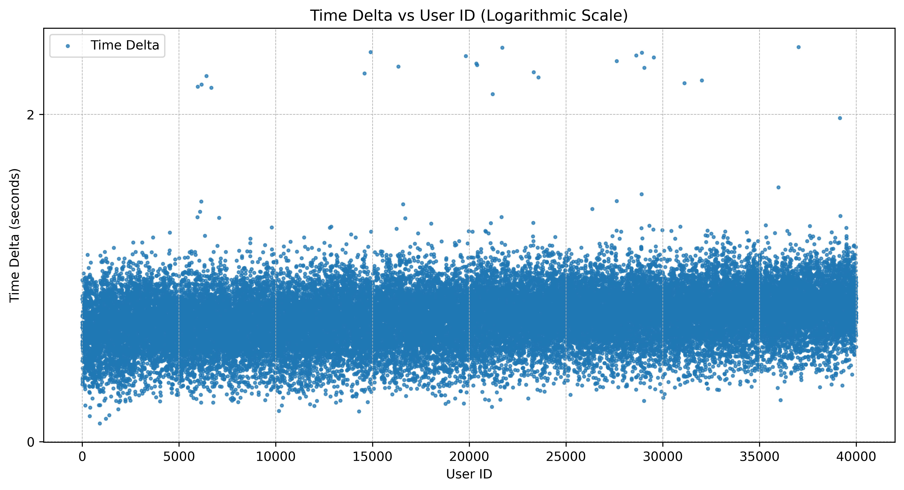

Number of users created over time:

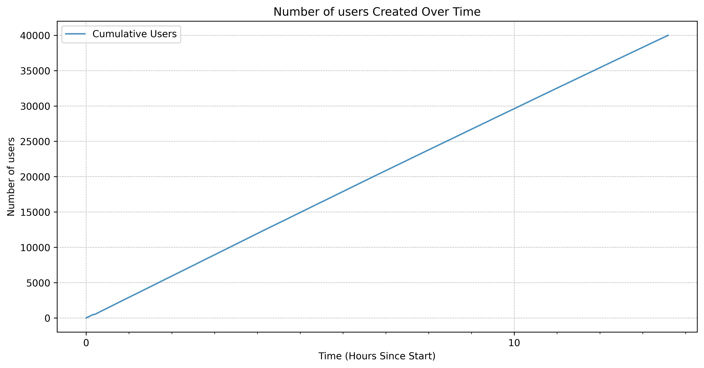

Group sync durations with linear scale:

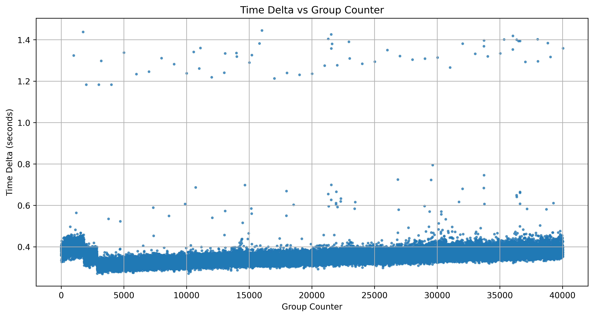

Group sync durations with logarythmic scale:

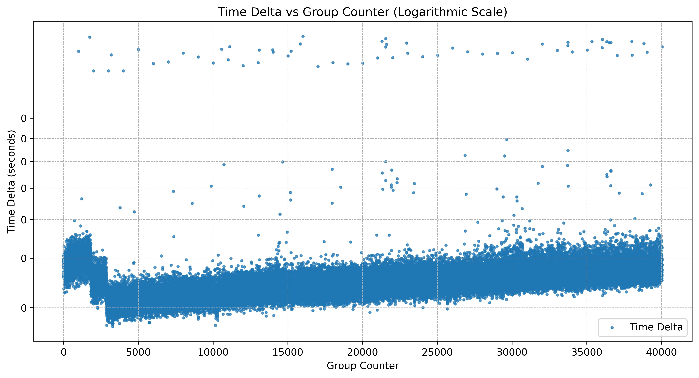

Number of groups created over time:

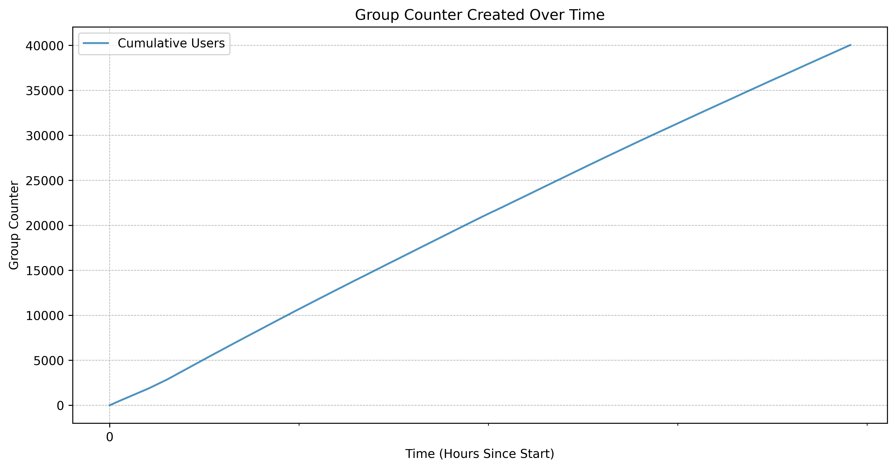

## More groups with Ceph storage backend

Scenario modifications:

- ~~100k Users in AD~~
- 40k Users in AD (to make the LDAP index unnecessary)
- ~~Every user is in one extra group with a maximum group size of 100~~
- ~~=> 100k / 100 = 1k Groups~~
- Every user is in one extra group with a maximum group size of 1000 and
in 10 groups with a maximum group size of 10
- => 40k / 1k + 40k / 10 * 10 = 40040 Groups = 40k Groups
To measure the performance with a 1:1 ratio of users and groups.
- ~~UDM adds every user to the same default primary group~~
- primary group updates are disabled
- The LDAP database is written to a Ceph-based pvc

**This load test was executed in parallel with the one above.**
It looks like the above test significantly affected the Ceph IO performance.

Basic stats:

Total users created: 40500  
Total user creation time: 0 days 15:27:24.030000  
average user creation time: 1.3739605916195508  
groups created: 35999  
Total group creation time: 0 days 16:50:22.540000  
Average group creation times:  
overall average: 1.6809656092004897  
average for 10 member groups: 1.677587378370843  
average_1000: 6.020785714285716  

User sync durations with linear scale:

User sync durations with logarythmic scale:

Number of users created over time:

Group sync durations with linear scale:

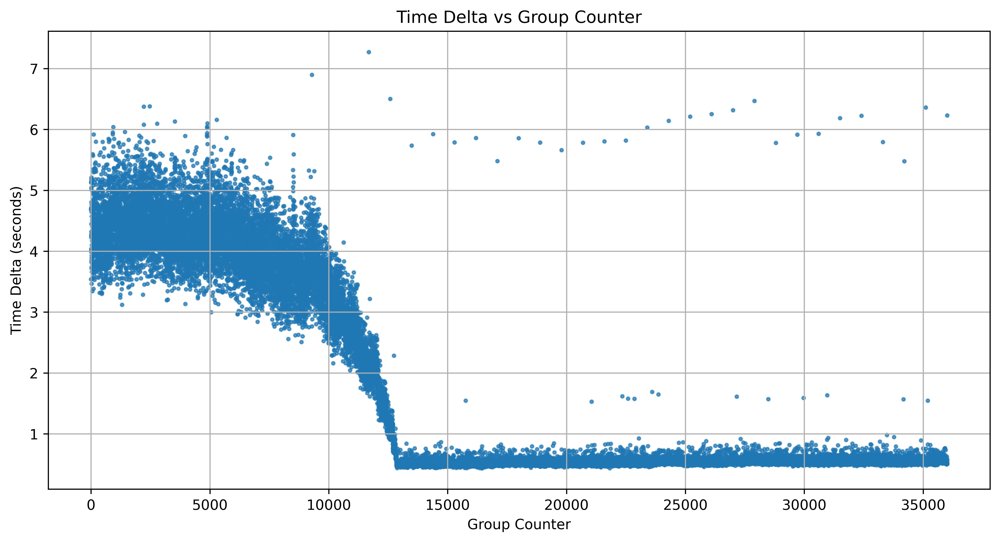

Group sync durations with logarythmic scale:

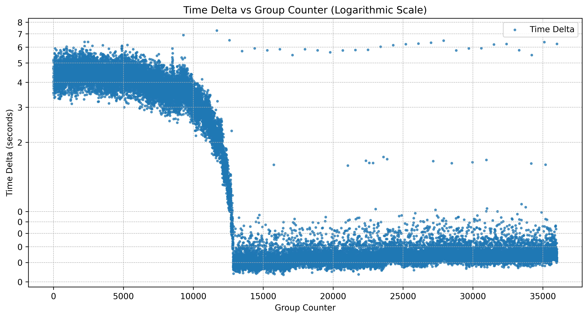

Number of groups created over time:

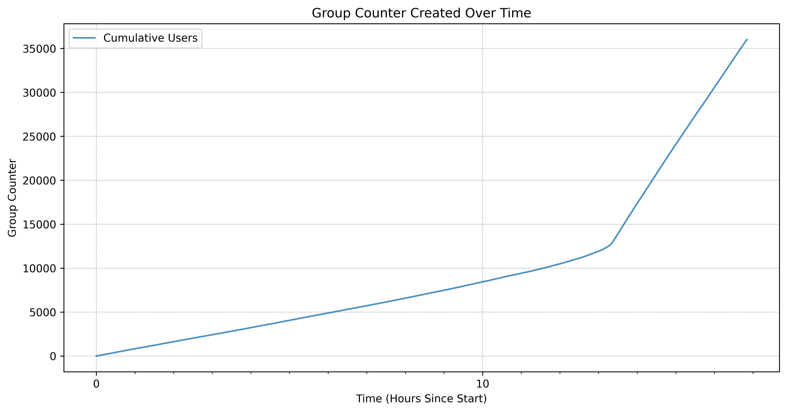
